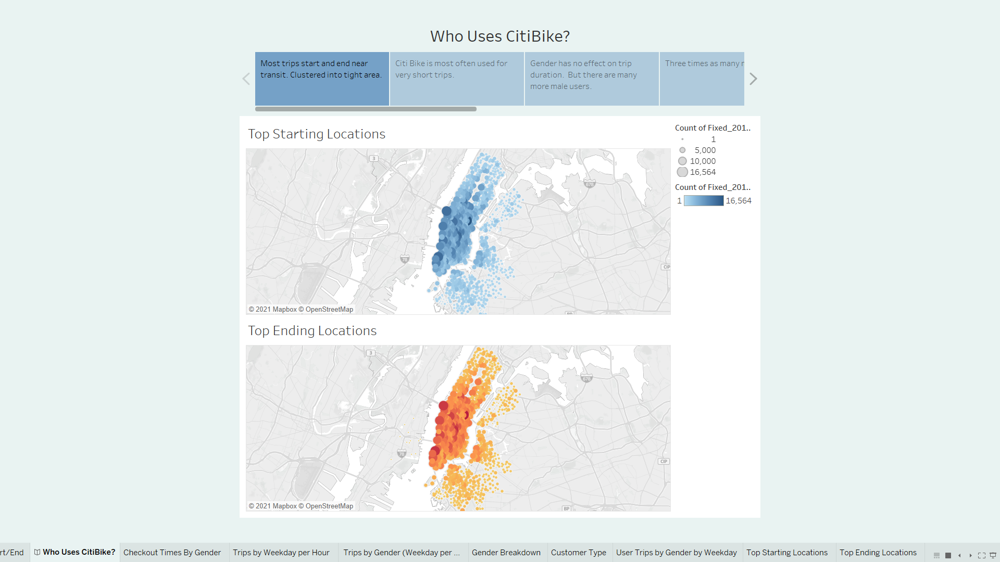
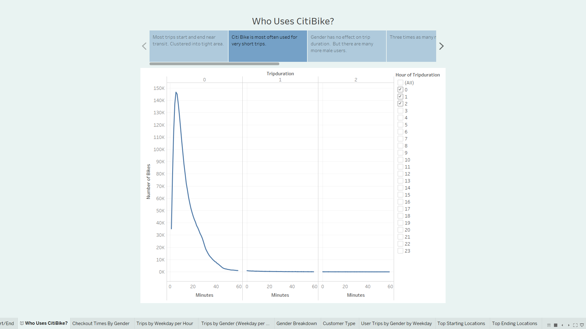
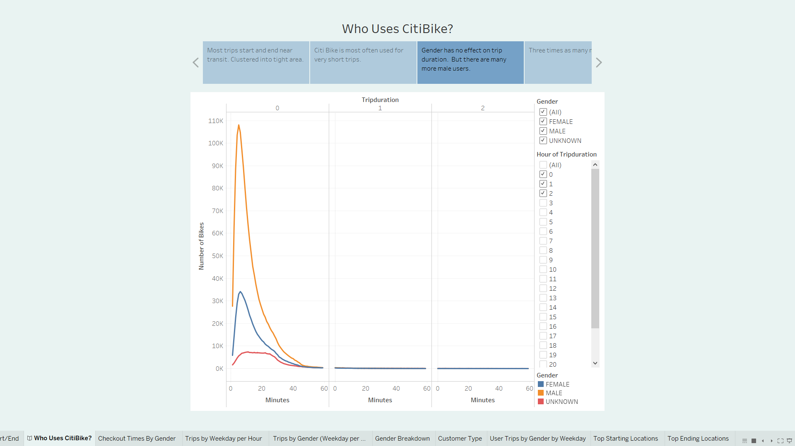
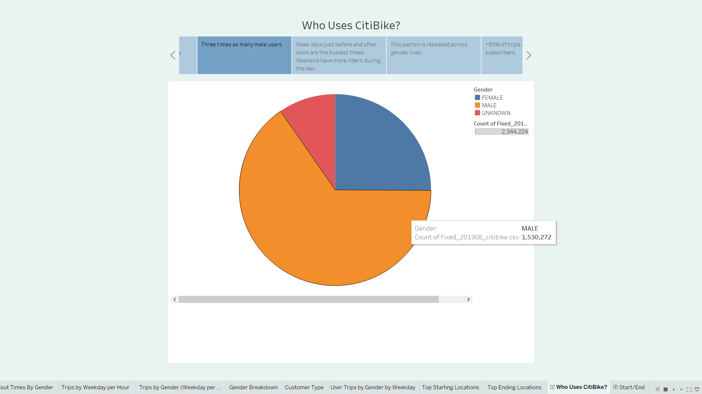
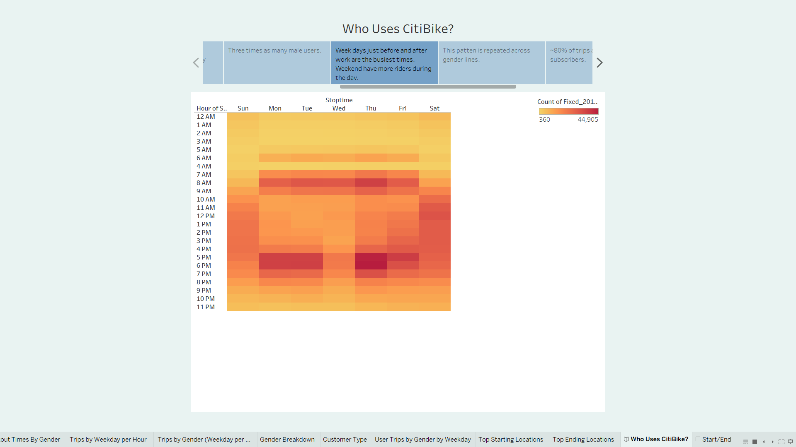
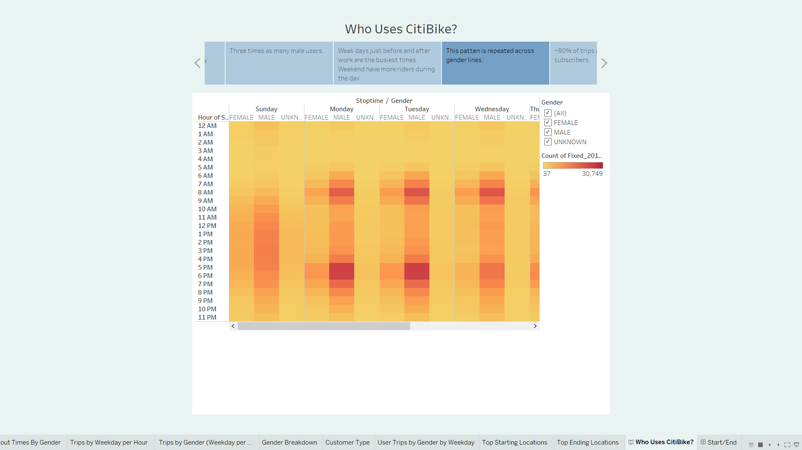
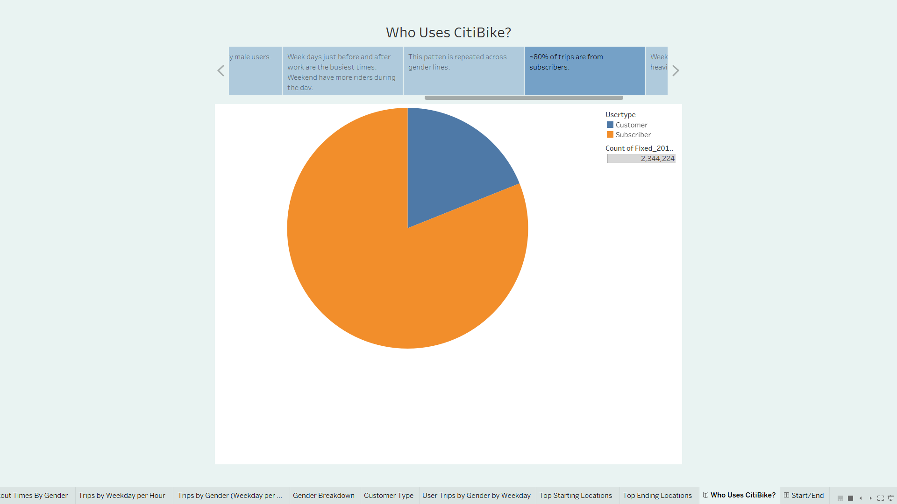
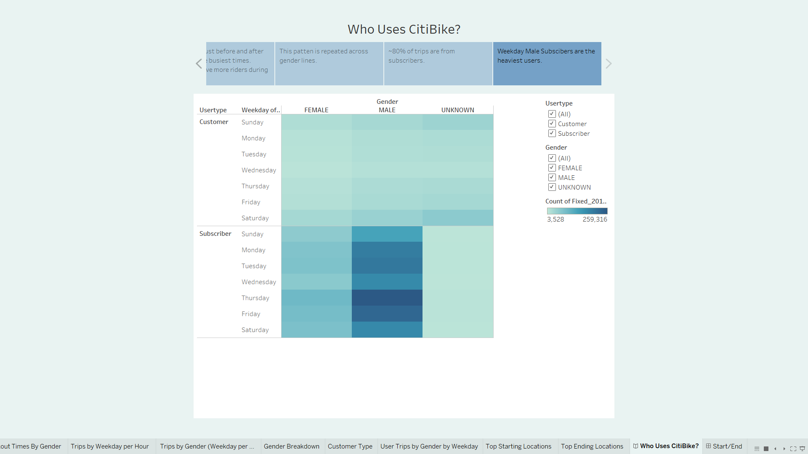

# Citi Bike Analysis

The written analysis has the following:

- Overview of the analysis: Explain the purpose of this analysis.
Overview of the statistical analysis:

- Results: Using the visualizations you have in your Tableau Story, describe the results of each visualization underneath the image.
The purpose of the analysis is well defined. (5 pt)
Results:

There are at least seven visualizations for the NYC Citibike analysis (7 pt)
There is a description of the results for each visualization (7 pt)

 - Summary: Provide a high-level summary of the results and two additional visualizations that you would perform with the given dataset
Summary:

There is a high-level summary of the results and two additional visualizations are suggested for future analysis (5 pt)

## Overview

- We are proposing bringing the popular bike sharing company "Citi Bike" to Des Moines.  First we need to examine available data to discover more about the way this program is utilized.  We will be working with the data gathered in New York in August 2019.  From this data we will be hoping to get a greater understanding of bike sharing in general and who it is that utilizes this service. We will do this  by looking at popular rental hours, duration of rentals, etc  
- We will first need to convert some of our csv data to datetime format using pandas library.
## Resources
Tableau, Pandas library, Jupyter notebook

## Results
[python code](NYC_Citibike_Challenge.ipynb)

[Tableau CitiBike Story](https://public.tableau.com/profile/russell.shelley#!/vizhome/CitiBikeProject_16148927450710/WhoUsesCitiBike)

-  We start with a map of trip start and end locations. 
    - These are very similar. Customers are riding back and forth between nearby locations.

- Looking at trip duration we see the majority of trips are very short around 5-10 minutes. There are very few long rentals.

- We can see that this pattern of short trips is repeated across genders. But there are many more male users.

- The pie chart illustrates this. There are three times as many male users.

- This heat map of 'stop times' shows clearly that the busiest usage times are just prior to work/just after work, on weekdays. The CitiBike has become a part of the journey to the office. Weekends show usage throughout the day.

- The next heat map shows how the story is repeated across genders. (We can also see that Wednesday is the quietest weekday--work from home Wednesday!)

- This next pie chart shows that most trips are made by subscribers, not casual users.

- Here we see that it is weekday, male, subscribers who take the most trips.  These are commuters, that have integrated CitiBike as part of there daily routine.

## Summary

 - From this data we can clearly see that most trips are made by loyal subscribers (~80%).  These subscribers are around 3 times as likely to be male over female. They are making short trips (around 5 mins), between work and public transit.
 This key demographic has made citi bike part of their daily life.  They enjoyed the program enough to subscribe and they are using these subscriptions.  CitiBike stations, near Des Moines DART stops could become a positive part of many workers day!  

### Further Analysis
- Although most of the trips are of the short commute link type. I would like to see how the revenue compares with weekend trips and casual users.  
- From the user type and trip duration we could see the cost of each non-subscriber trip.
- I would like to compare the revenue gained by non-subscribers/ to the revenue gained from subscribers. Are the casual riders more relevant than at first appears?  (pie chart) 
- How do single ride($3) sales, look compared to day pass rides($15)? (pie chart)
- What is the difference in revenue between stations? (heatmap)
